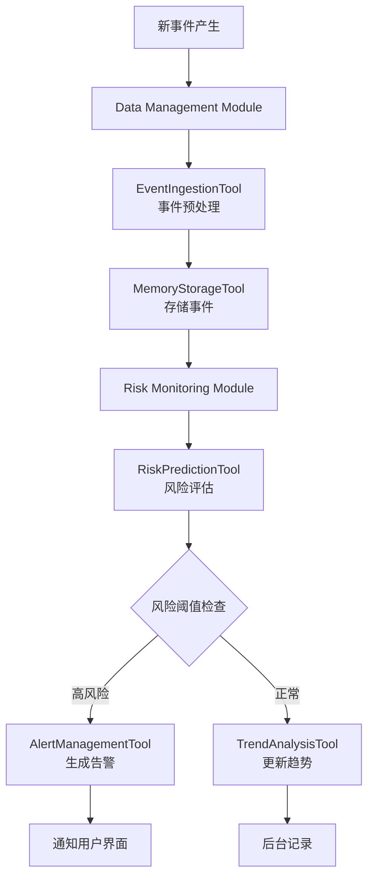

# ICUAgent 单体智能重症监护代理架构设计

## 1. 系统概述

ICUAgent是一个集成式的智能重症监护代理，通过模块化设计将复杂的ICU医疗决策支持功能整合在单一Agent中。该设计避免了多Agent系统的复杂性，同时保持了功能的专业化和可扩展性。

### 1.1 设计理念

- **单体集成**: 单一Agent减少系统复杂度和维护成本
- **模块化设计**: 内部功能模块化，便于开发和维护
- **统一接口**: 对外提供一致的API接口
- **专业工具**: 每个模块配备专业化的工具集
- **渐进式实现**: 支持逐步添加和完善功能模块

## 2. 整体架构设计

### 2.1 核心架构图

```
┌─────────────────────────────────────────────────────────────────┐
│                          ICUAgent                              │
├─────────────────────────────────────────────────────────────────┤
│                      用户交互层                                    │
│                   (Query Interface)                           │
├─────────────────────────────────────────────────────────────────┤
│                    任务规划与协调层                                 │
│            (Query Understanding & Task Planning)              │
├─────────────────────────────────────────────────────────────────┤
│                       核心功能模块层                               │
│ ┌─────────────────┐ ┌─────────────────┐ ┌─────────────────┐   │
│ │ Data Management │ │ Risk Monitoring │ │Clinical Decision│   │
│ │   数据管理模块      │ │   风险监控模块    │ │   临床决策模块    │   │
│ └─────────────────┘ └─────────────────┘ └─────────────────┘   │
│                                                               │
│ ┌─────────────────┐ ┌─────────────────┐ ┌─────────────────┐   │
│ │Pharmacy Analysis│ │Knowledge Manage │ │   Reporting     │   │
│ │   药物分析模块      │ │   知识管理模块    │ │   报告生成模块    │   │
│ └─────────────────┘ └─────────────────┘ └─────────────────┘   │
├─────────────────────────────────────────────────────────────────┤
│                       工具与基础设施层                              │
│        Vector DB │ Event Bus │ Cache │ External APIs           │
└─────────────────────────────────────────────────────────────────┘
```

### 2.2 架构优势

相比多Agent架构，单Agent设计的优势：

1. **简化通信**: 模块间直接调用，无需复杂的消息传递
2. **统一状态**: 共享内存和状态，避免数据同步问题
3. **便于调试**: 单一进程，更容易追踪和调试
4. **降低延迟**: 减少网络通信开销
5. **简化部署**: 单一部署单元，降低运维复杂度

## 3. 核心模块设计

### 3.1 Query Understanding & Task Planning Module (查询理解与任务规划模块)

**核心职责**：
- 理解用户的自然语言输入
- 分析查询意图和医疗语义
- 制定执行计划并协调各模块

**主要功能**：
```python
class QueryPlanningModule:
    def parse_query(self, user_input: str) -> QueryIntent
    def create_execution_plan(self, intent: QueryIntent) -> ExecutionPlan  
    def coordinate_modules(self, plan: ExecutionPlan) -> Response
    def synthesize_results(self, module_results: List[Dict]) -> str
```

**处理的典型场景**：
- "发生XX情况后，该做什么处理" → 情况识别 + 知识检索 + 治疗建议
- "病人器官衰竭如何减少药物损伤" → 状态分析 + 药物分析 + 决策支持
- "CRRT抗凝vs消化道出血禁忌" → 矛盾分析 + 风险评估 + 平衡决策

### 3.2 Data Management Module (数据管理模块)

**核心职责**：
- 整合原ICUDataIngestionAgent和ICUMemoryAgent功能
- 事件摄取、存储和检索
- 向量搜索和时间序列查询

**主要组件**：
```python
class DataManagementModule:
    def __init__(self):
        self.event_ingestion = EventIngestionTool()
        self.memory_storage = MemoryStorageTool() 
        self.query_engine = QueryEngineTool()
        self.data_collector = DataCollectorTool()
```

**工具集**：
- **EventIngestionTool**: 事件摄取和预处理（保留UMLS翻译功能）
- **MemoryStorageTool**: 向量存储和检索
- **QueryEngineTool**: 复杂查询执行
- **DataCollectorTool**: 数据收集规划和执行

### 3.3 Risk Monitoring Module (风险监控模块)

**核心职责**：
- 整合原ICURiskPredictionAgent和ICUMonitorAgent功能
- 风险预测、持续监控和异常检测
- 智能告警和趋势分析

**主要组件**：
```python
class RiskMonitoringModule:
    def __init__(self):
        self.risk_predictor = RiskPredictionTool()
        self.anomaly_detector = AnomalyDetectionTool()
        self.alert_manager = AlertManagementTool()
        self.trend_analyzer = TrendAnalysisTool()
```

**工具集**：
- **RiskPredictionTool**: 风险识别和评估（保留现有风险表功能）
- **AnomalyDetectionTool**: 异常模式检测
- **AlertManagementTool**: 智能告警生成和管理
- **TrendAnalysisTool**: 风险趋势分析和预测

### 3.4 Clinical Decision Module (临床决策模块)

**核心职责**：
- 临床决策支持和治疗建议
- 矛盾决策权衡和方案比较
- 个性化治疗方案生成

**主要组件**：
```python
class ClinicalDecisionModule:
    def __init__(self):
        self.guideline_engine = GuidelineEngineTool()
        self.decision_tree = DecisionTreeTool()
        self.conflict_resolver = ConflictResolverTool()
        self.treatment_optimizer = TreatmentOptimizerTool()
```

**工具集**：
- **GuidelineEngineTool**: 临床指南集成和检索
- **DecisionTreeTool**: 动态决策路径构建
- **ConflictResolverTool**: 矛盾决策处理器
- **TreatmentOptimizerTool**: 治疗方案优化

### 3.5 Pharmacy Analysis Module (药物分析模块)

**核心职责**：
- 药物相互作用分析
- 剂量优化和不良反应预测
- 个性化用药建议

**主要组件**：
```python
class PharmacyAnalysisModule:
    def __init__(self):
        self.drug_interaction = DrugInteractionTool()
        self.dosage_calculator = DosageCalculatorTool()
        self.adr_predictor = ADRPredictorTool()
        self.alternative_finder = AlternativeFinderTool()
```

**工具集**：
- **DrugInteractionTool**: 药物相互作用检测
- **DosageCalculatorTool**: 个性化剂量计算
- **ADRPredictorTool**: 不良药物反应预测
- **AlternativeFinderTool**: 药物替代方案建议

### 3.6 Knowledge Management Module (知识管理模块)

**核心职责**：
- 医疗知识库管理和检索
- 临床指南版本管理
- 文献搜索和知识推理

**主要组件**：
```python
class KnowledgeManagementModule:
    def __init__(self):
        self.knowledge_graph = KnowledgeGraphTool()
        self.literature_search = LiteratureSearchTool()
        self.guideline_manager = GuidelineManagerTool()
        self.knowledge_reasoner = KnowledgeReasonerTool()
```

**工具集**：
- **KnowledgeGraphTool**: 医疗知识图谱管理
- **LiteratureSearchTool**: 文献搜索和摘要
- **GuidelineManagerTool**: 临床指南管理
- **KnowledgeReasonerTool**: 知识推理引擎

## 4. 典型工作流示例

### 4.1 复杂临床咨询处理流程

```mermaid
flowchart TD
    A[用户输入: "病人器官衰竭，如何减少药物损伤？"] --> B[Query Planning Module]
    B --> C[解析查询意图]
    C --> D[制定执行计划]
    D --> E[并行调用相关模块]
    
    E --> F[Data Management<br/>获取病人状态]
    E --> G[Risk Monitoring<br/>评估器官衰竭风险]
    E --> H[Knowledge Management<br/>检索相关指南]
    
    F --> I[结果合成]
    G --> I
    H --> I
    
    I --> J[Clinical Decision<br/>生成治疗建议]
    J --> K[Pharmacy Analysis<br/>药物安全分析]
    K --> L[最终建议生成]
    L --> M[返回用户]
```

### 4.2 矛盾决策处理流程

```mermaid
flowchart TD
    A[用户输入: "CRRT抗凝vs消化道出血禁忌"] --> B[Query Planning Module]
    B --> C[识别矛盾决策场景]
    C --> D[制定冲突分析计划]
    
    D --> E[Data Management<br/>获取病人出血史]
    D --> F[Risk Monitoring<br/>评估双重风险]
    D --> G[Pharmacy Analysis<br/>分析抗凝药物选择]
    
    E --> H[Clinical Decision Module]
    F --> H
    G --> H
    
    H --> I[ConflictResolverTool<br/>权衡利弊]
    I --> J[生成平衡决策建议]
    J --> K[返回用户]
```

### 4.3 实时事件处理流程



## 5. 技术实现架构

### 5.1 模块通信机制

**内部通信**：
```python
class ICUAgent:
    def __init__(self):
        self.query_planner = QueryPlanningModule()
        self.data_manager = DataManagementModule()
        self.risk_monitor = RiskMonitoringModule()
        self.clinical_decision = ClinicalDecisionModule()
        self.pharmacy_analysis = PharmacyAnalysisModule()
        self.knowledge_manager = KnowledgeManagementModule()
        
        # 模块间共享状态
        self.shared_context = SharedContext()
        self.event_bus = InternalEventBus()
```

**模块接口标准化**：
```python
class BaseModule:
    def process(self, input_data: Dict, context: SharedContext) -> Dict
    def get_capabilities(self) -> List[str]
    def health_check(self) -> bool
```

### 5.2 数据层设计

**统一数据访问**：
- 继续使用ScalableMemory + DuckDB进行向量存储
- 共享缓存层减少重复计算
- 统一的数据模型和接口

**数据流**：
```
事件输入 → DataManagement → 各模块处理 → 结果缓存 → 用户输出
```

### 5.3 配置和扩展

**模块配置**：
```yaml
modules:
  data_management:
    enabled: true
    tools: [event_ingestion, memory_storage, query_engine, data_collector]
  
  risk_monitoring:
    enabled: true
    tools: [risk_prediction, anomaly_detection, alert_management, trend_analysis]
    
  clinical_decision:
    enabled: true
    tools: [guideline_engine, decision_tree, conflict_resolver, treatment_optimizer]
```

**工具热插拔**：
- 支持动态加载和卸载工具
- 工具版本管理和升级
- 自定义工具开发框架

## 6. 实施路线图

### 6.1 第一阶段：核心框架搭建

**目标**：建立ICUAgent基础架构
**时间**：2-3周

**任务**：
1. 创建ICUAgent主类和模块基础框架
2. 实现Query Planning Module的基础功能
3. 迁移和集成现有ICUMemoryAgent功能到Data Management Module
4. 建立内部通信机制

**交付物**：
- ICUAgent基础代码框架
- 基础查询处理能力
- 数据管理模块（继承现有功能）

### 6.2 第二阶段：核心模块实现

**目标**：实现主要业务模块
**时间**：3-4周

**任务**：
1. 实现Risk Monitoring Module（整合风险预测和监控）
2. 实现Clinical Decision Module基础功能
3. 开发基础的Pharmacy Analysis Module
4. 集成现有的风险预测能力

**交付物**：
- 风险监控模块
- 基础临床决策能力
- 药物分析基础功能

### 6.3 第三阶段：高级功能和优化

**目标**：完善高级功能并优化性能
**时间**：2-3周

**任务**：
1. 实现Knowledge Management Module
2. 完善矛盾决策处理能力
3. 性能优化和缓存机制
4. 完整的测试用例

**交付物**：
- 完整的ICUAgent系统
- 高级决策支持功能
- 性能优化版本

## 7. 与现有系统的对比

### 7.1 功能整合对比

| 原多Agent系统 | 新ICUAgent系统 | 整合方式 |
|--------------|---------------|----------|
| ICUAssistantAgent | Query Planning Module | 升级为智能规划器 |
| ICUDataIngestionAgent + ICUMemoryAgent | Data Management Module | 合并为统一数据管理 |
| ICURiskPredictionAgent + ICUMonitorAgent | Risk Monitoring Module | 整合为风险监控模块 |
| ICUDecisionAgent | Clinical Decision Module | 直接转换为内部模块 |
| ICUPharmacyAgent | Pharmacy Analysis Module | 直接转换为内部模块 |
| ICUKnowledgeAgent | Knowledge Management Module | 直接转换为内部模块 |

### 7.2 架构优势对比

| 对比维度 | 多Agent系统 | 单Agent系统 | 优势 |
|---------|------------|------------|------|
| 系统复杂度 | 高 | 中等 | ✓ 降低复杂度 |
| 通信延迟 | 高 | 低 | ✓ 提升性能 |
| 部署难度 | 高 | 低 | ✓ 简化部署 |
| 调试难度 | 高 | 低 | ✓ 便于调试 |
| 功能完整性 | 完整 | 完整 | ✓ 保持功能 |
| 可扩展性 | 高 | 中等 | - 稍有降低 |

## 8. 总结

ICUAgent单体架构设计在保持功能完整性的同时，显著降低了系统复杂度：

### 8.1 核心优势

1. **简化架构**: 单Agent设计减少了系统复杂度
2. **保持功能**: 所有原有功能通过模块化设计得以保留
3. **提升性能**: 减少网络通信，提高响应速度
4. **便于维护**: 单一部署单元，降低运维成本
5. **渐进实现**: 支持分阶段开发和部署

### 8.2 设计理念实现

- **模块化**: 将功能分解为独立的模块和工具
- **统一接口**: 对外提供一致的API体验
- **内部优化**: 模块间直接通信，共享状态
- **专业工具**: 每个领域配备专业化工具集

### 8.3 适用场景

这个单Agent架构特别适合：
- 中小规模的ICU环境
- 需要快速部署的医疗机构
- 对系统简洁性有要求的场景
- 希望降低维护成本的应用

通过这个设计，我们能够以更简洁的方式实现复杂的ICU智能决策支持功能，为医护人员提供高效、可靠的临床决策支持。
