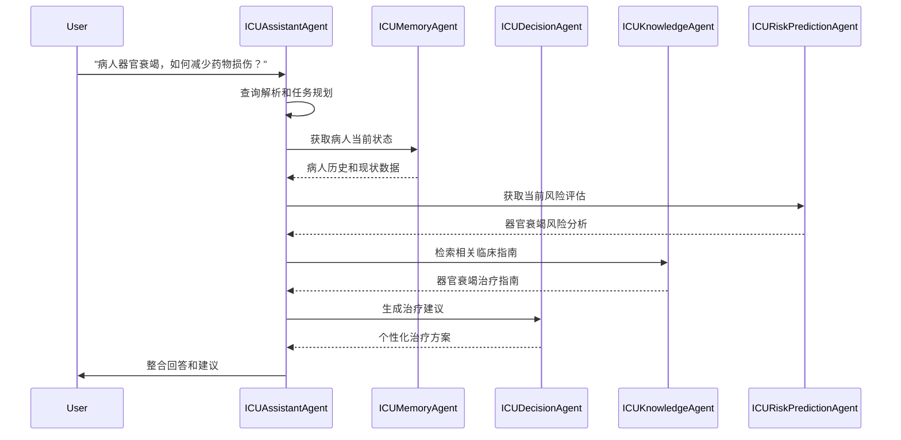
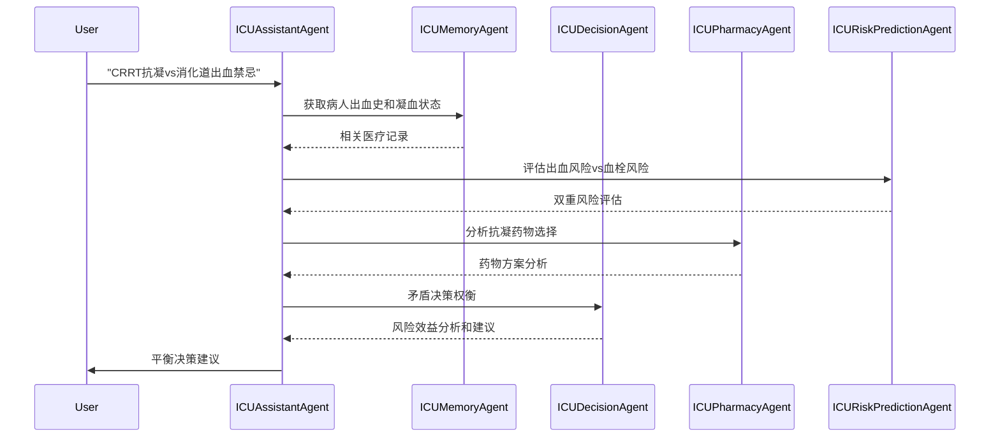
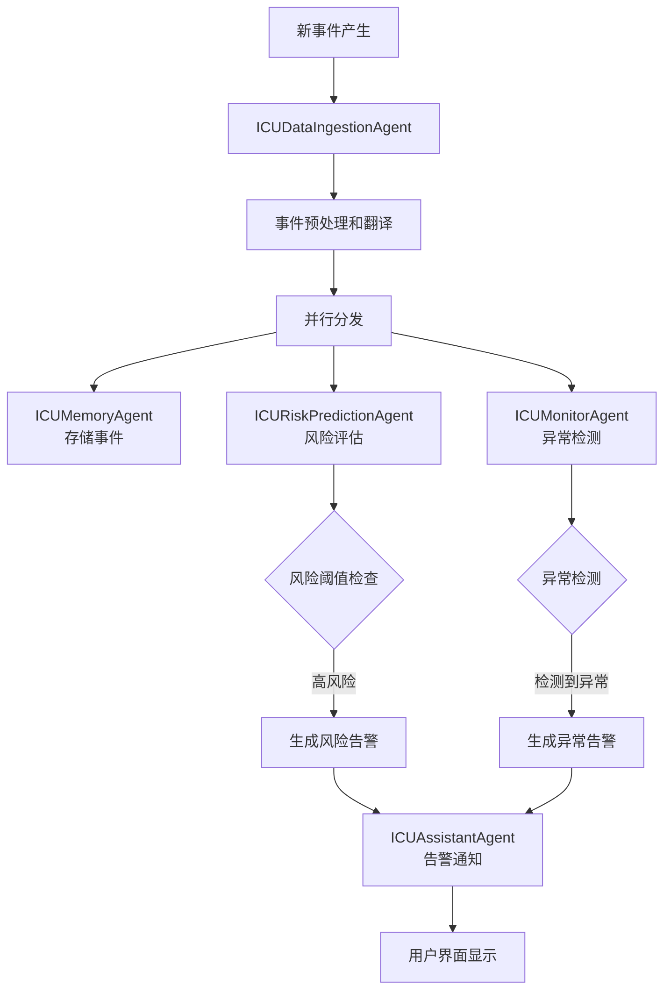

# ICU多Agent系统架构设计

## 1. 系统概述

ICU多Agent系统是一个智能化的重症监护医疗决策支持系统，通过多个专业化Agent的协作，为医护人员提供实时的数据分析、风险预测、临床决策支持和治疗建议。

### 1.1 设计理念

- **专业化分工**: 每个Agent专注于特定的医疗领域和功能
- **异步协作**: Agent之间通过事件驱动和消息传递进行协作
- **实时响应**: 支持实时事件流处理和即时决策支持
- **知识驱动**: 集成医疗知识库和临床指南
- **可扩展性**: 模块化设计，便于添加新的Agent和功能

## 2. 现有系统分析

### 2.1 当前Agent能力矩阵

| Agent | 主要功能 | 优势 | 局限性 |
|-------|----------|------|--------|
| ICUAssistantAgent | 用户交互协调 | 基础事件重放 | 缺乏智能规划和复杂查询处理 |
| ICUDataIngestionAgent | 数据摄取处理 | 事件批处理、UMLS翻译 | 缺乏实时流处理和复杂预处理 |
| ICUMemoryAgent | 记忆存储查询 | 向量搜索、时间查询、数据收集规划 | 功能相对完善 |
| ICURiskPredictionAgent | 风险预测诊断 | 风险识别、缓存机制 | 缺乏持续监控和动态更新 |

### 2.2 典型用户场景分析

基于用户提到的典型输入场景：

1. **"发生XX情况后，该做什么处理"** 
   - 需要：情况识别 → 知识检索 → 治疗方案生成
   - 当前能力缺口：缺乏临床知识库和治疗方案生成

2. **"目前病人xxx器官都在衰竭的一个叠加态下，怎样做才能减少药物的损伤，还要起到最大的治疗效果？"**
   - 需要：多器官状态分析 → 药物相互作用分析 → 个性化治疗优化
   - 当前能力缺口：缺乏药物分析和治疗优化Agent

3. **"这个病人做CRRT要不要抗凝，不抗凝会增加管路凝血风险，该病人是消化道出血的病人，抗凝又是消化道出血的禁忌"**
   - 需要：矛盾决策分析 → 风险权衡 → 个性化决策建议
   - 当前能力缺口：缺乏临床决策支持和矛盾处理能力

## 3. 完整架构设计

### 3.1 整体架构图

```
┌─────────────────────────────────────────────────────────────────────┐
│                           用户界面层                                   │
├─────────────────────────────────────────────────────────────────────┤
│                      ICUAssistantAgent                             │
│                        (智能协调器)                                    │
├─────────────────────────────────────────────────────────────────────┤
│                         核心业务层                                      │
│  ┌─────────────────┐  ┌─────────────────┐  ┌─────────────────┐     │
│  │ ICUMemoryAgent  │  │ICUDecisionAgent │  │ICUMonitorAgent  │     │
│  │   (记忆管理)      │  │   (决策支持)     │  │   (监控告警)     │     │
│  └─────────────────┘  └─────────────────┘  └─────────────────┘     │
│                                                                     │
│  ┌─────────────────┐  ┌─────────────────┐  ┌─────────────────┐     │
│  │ICURiskPrediction│  │ICUPharmacyAgent │  │ICUKnowledgeAgent│     │
│  │Agent(风险预测)    │  │   (药物分析)     │  │   (知识管理)     │     │
│  └─────────────────┘  └─────────────────┘  └─────────────────┘     │
├─────────────────────────────────────────────────────────────────────┤
│                        数据处理层                                      │
│              ICUDataIngestionAgent (数据摄取处理)                     │
├─────────────────────────────────────────────────────────────────────┤
│                        基础设施层                                      │
│     事件总线    │    消息队列    │   向量数据库   │   知识图谱        │
└─────────────────────────────────────────────────────────────────────┘
```

### 3.2 Agent详细设计

#### 3.2.1 ICUAssistantAgent (智能协调器) - 升级版

**核心职责**：
- 接收和理解用户自然语言输入
- 智能查询规划和任务分解
- 多Agent协调和工作流编排
- 结果整合和用户交互

**新增能力**：
- **查询理解模块**: 使用NLP技术解析复杂医疗查询
- **任务规划器**: 将复杂查询分解为可执行的子任务
- **工作流引擎**: 管理多Agent协作流程
- **结果合成器**: 整合多源信息生成连贯回答

**典型工作流**：
```
用户输入 → 查询解析 → 任务规划 → Agent调度 → 结果整合 → 用户反馈
```

#### 3.2.2 ICUDataIngestionAgent (数据摄取处理) - 增强版

**现有功能保持**：
- 事件加载和重放
- UMLS翻译
- 批量处理

**新增能力**：
- **实时事件流处理**: 支持消息队列接入
- **数据质量检查**: 事件数据验证和清洗
- **事件聚合器**: 相关事件的智能聚合和关联

#### 3.2.3 ICUMemoryAgent (记忆管理) - 当前最完善

**保持现有优势**：
- 向量搜索和时间查询
- 数据收集规划
- 缓存机制

**优化方向**：
- **智能索引**: 基于医疗语义的多维度索引
- **关联分析**: 事件间的因果关系挖掘
- **个性化记忆**: 针对特定病人的记忆优化

#### 3.2.4 ICURiskPredictionAgent (风险预测) - 增强版

**现有功能保持**：
- 风险识别和诊断
- 风险表管理

**新增能力**：
- **持续风险监控**: 实时风险状态更新
- **风险趋势分析**: 风险变化趋势预测
- **多维风险模型**: 结合多种算法的风险评估
- **风险告警系统**: 自动生成风险警报

#### 3.2.5 ICUDecisionAgent (临床决策支持) - 新增

**核心职责**：
- 临床决策支持和建议生成
- 治疗方案比较和优化
- 矛盾决策的权衡分析
- 个性化治疗建议

**主要模块**：
- **临床指南引擎**: 集成临床指南和最佳实践
- **决策树构建**: 动态构建决策路径
- **风险效益分析**: 量化治疗方案的风险和收益
- **矛盾处理器**: 处理相互冲突的治疗建议

#### 3.2.6 ICUPharmacyAgent (药物分析) - 新增

**核心职责**：
- 药物相互作用分析
- 药物剂量优化
- 不良反应预测
- 个性化用药建议

**主要功能**：
- **药物知识库**: 药物信息和相互作用数据
- **剂量计算器**: 基于病人状态的剂量优化
- **ADR预测**: 不良药物反应风险评估
- **替代方案**: 药物替代建议

#### 3.2.7 ICUMonitorAgent (监控告警) - 新增

**核心职责**：
- 实时生命体征监控
- 异常状态检测
- 智能告警生成
- 紧急事件响应

**主要功能**：
- **异常检测器**: ML算法检测异常模式
- **告警管理**: 智能告警过滤和优先级排序
- **趋势监控**: 长期趋势变化检测
- **应急响应**: 紧急情况的自动响应流程

#### 3.2.8 ICUKnowledgeAgent (知识管理) - 新增

**核心职责**：
- 医疗知识库管理
- 临床指南集成
- 最新研究文献检索
- 知识图谱构建

**主要功能**：
- **知识图谱**: 医疗概念和关系的图谱表示
- **文献检索**: 实时医学文献搜索和摘要
- **指南更新**: 临床指南的版本管理
- **知识推理**: 基于知识图谱的推理能力

### 3.3 Agent协作工作流

#### 3.3.1 典型场景1：复杂临床咨询处理



#### 3.3.2 典型场景2：矛盾决策处理



#### 3.3.3 实时事件处理流



## 4. 技术架构

### 4.1 通信机制

**事件总线**：
- 基于Redis Pub/Sub或RabbitMQ
- 支持事件的发布、订阅和路由
- 保证消息的可靠传递

**API接口**：
- RESTful API用于同步请求
- WebSocket用于实时通信
- GraphQL用于复杂查询

### 4.2 数据存储

**向量数据库**：
- 继续使用ScalableMemory + DuckDB
- 支持医疗语义的向量搜索

**关系数据库**：
- PostgreSQL存储结构化数据
- 支持复杂查询和事务

**知识图谱**：
- Neo4j存储医疗概念和关系
- 支持图查询和推理

**缓存系统**：
- Redis用于热点数据缓存
- 提升查询性能

### 4.3 部署架构

**微服务架构**：
- 每个Agent独立部署
- 支持水平扩展

**容器化**：
- Docker容器部署
- Kubernetes编排管理

**监控和日志**：
- 统一日志收集和分析
- 系统性能监控

## 5. 数据流设计

### 5.1 事件数据流

```
原始事件 → 数据摄取 → 预处理 → 并行分发 → 各Agent处理 → 结果聚合
```

### 5.2 查询数据流

```
用户查询 → 查询解析 → 任务分解 → 并行执行 → 结果合成 → 用户响应
```

### 5.3 告警数据流

```
异常检测 → 告警生成 → 优先级排序 → 告警分发 → 用户通知
```

## 6. 实施计划

### 6.1 第一阶段：核心Agent增强

1. **ICUAssistantAgent升级**
   - 实现查询解析和任务规划
   - 添加多Agent协调能力

2. **ICUDecisionAgent开发**
   - 实现基础决策支持功能
   - 集成临床指南

3. **事件总线搭建**
   - 实现基础的消息传递机制

### 6.2 第二阶段：专业化Agent开发

1. **ICUPharmacyAgent开发**
   - 药物分析和相互作用检测

2. **ICUMonitorAgent开发**
   - 实时监控和异常检测

3. **ICUKnowledgeAgent开发**
   - 知识库集成和管理

### 6.3 第三阶段：系统集成和优化

1. **端到端工作流测试**
2. **性能优化和扩展**
3. **用户界面完善**

## 7. 质量保证

### 7.1 测试策略

- **单元测试**: 每个Agent的功能测试
- **集成测试**: Agent间协作测试
- **端到端测试**: 完整场景测试
- **压力测试**: 系统性能测试

### 7.2 监控指标

- **系统性能**: 响应时间、吞吐量
- **准确性**: 决策建议的临床准确性
- **可用性**: 系统稳定性和可靠性

## 8. 总结

这个架构设计通过以下方式解决了现有系统的局限性：

1. **智能协调**: ICUAssistantAgent升级为智能协调器，具备复杂查询处理能力
2. **专业化分工**: 新增专业化Agent处理特定医疗领域
3. **实时响应**: 事件驱动架构支持实时处理
4. **知识驱动**: 集成医疗知识库和临床指南
5. **协作机制**: 完善的Agent间协作和通信机制

该架构能够有效处理复杂的临床场景，为医护人员提供智能化的决策支持，显著提升ICU的医疗质量和效率。
